# Biblioteca El Roble

**Autor:** Jeremy Renteria Serna  
**Asignatura:** Ingeniería Web  
**Temática:** Biblioteca

Aplicación web de una biblioteca desarrollada con Node.js y SQLite. Permite registrar lectores y solicitar préstamos usando el ID generado por el registro.

## Tecnologías

- HTML semántico y CSS externo.
- Node.js con `node:http`, `node:fs`, `node:path` y `node:sqlite`.
- SQLite mediante `DatabaseSync`.
- Sin frameworks ni dependencias externas.

## Estructura

```text
ingenieria web/
├── index.html
├── acerca.html
├── registro.html
├── servicios.html
├── styles.css
├── server.js
├── biblioteca.db
├── capturas/
└── README.md
```

## Base de datos

El archivo `biblioteca.db` contiene dos tablas:

### `lectores`

| Columna | Tipo | Descripción |
|---|---|---|
| `id` | INTEGER | ID autoincremental |
| `nombre` | TEXT | Nombre del lector |
| `correo` | TEXT | Correo del lector |
| `telefono` | TEXT | Teléfono del lector |

### `prestamos`

| Columna | Tipo | Descripción |
|---|---|---|
| `id` | INTEGER | ID autoincremental |
| `lector_id` | INTEGER | ID existente en `lectores` |
| `libro` | TEXT | Libro solicitado |
| `fecha_prestamo` | TEXT | Fecha del préstamo |
| `dias` | INTEGER | Duración del préstamo |

## Rutas

| Método | Ruta | Función |
|---|---|---|
| GET | `/` | Página principal |
| GET | `/acerca` | Información del proyecto |
| GET | `/registro` | Formulario de lectores |
| GET | `/servicios` | Formulario de préstamos |
| POST | `/lectores` | Registra nombre, correo y teléfono |
| POST | `/prestamos` | Registra lector_id, libro, fecha_prestamo y dias |

## Requisitos

- Node.js 24 o superior. Este proyecto usa `node:sqlite`, incluido en Node.js.
- No es necesario ejecutar `npm install`.

## Ejecutar localmente

Desde PowerShell:

```powershell
git clone https://github.com/JeremyRenteria/Biblioteca.git
cd Biblioteca
node --version
node server.js
```

También se puede ejecutar directamente desde la carpeta local:

```powershell
cd "C:\Users\maria\Downloads\ingenieria web"
node server.js
```

Luego abre:

```text
http://localhost:3000
```

El servidor imprime la URL, la ruta de `biblioteca.db`, las peticiones recibidas y las confirmaciones de los formularios. Para detenerlo, presiona `Ctrl + C`.

## Prueba manual

1. Abre `http://localhost:3000/registro`.
2. Completa nombre, correo y teléfono.
3. Guarda el ID generado por SQLite.
4. Abre `http://localhost:3000/servicios`.
5. Escribe el ID, libro, fecha y días.
6. Envía el préstamo y revisa la confirmación en la página y en la terminal.

Ejemplo de confirmación en terminal:

```text
[CONFIRMACION] POST /prestamos — préstamo registrado correctamente
  lector_id: 7 | libro: "Rayuela" | fecha_prestamo: 2026-09-14 | dias: 10
```

## Capturas

Las evidencias están en `capturas/` y también se muestran en esta documentación:

### Páginas y respuestas

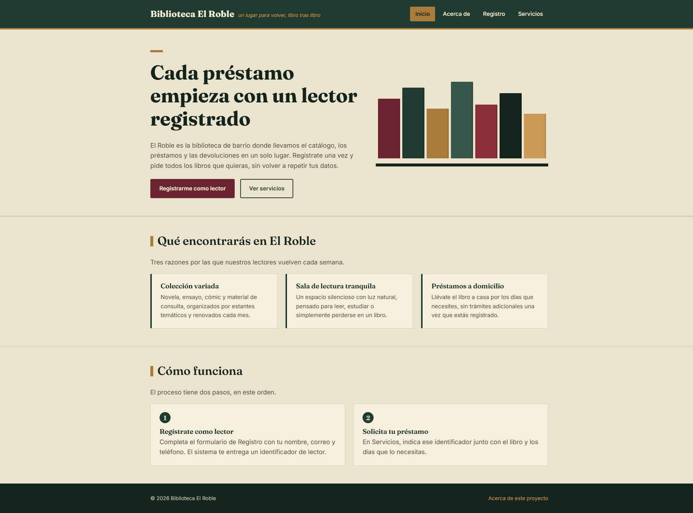

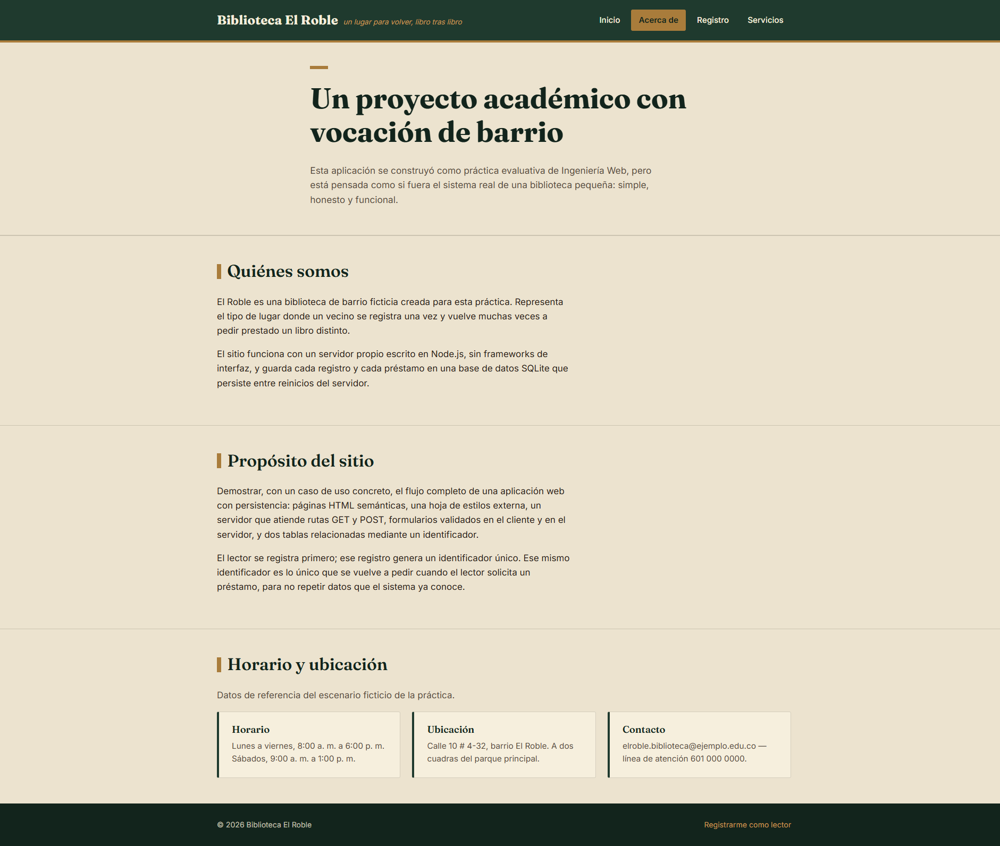

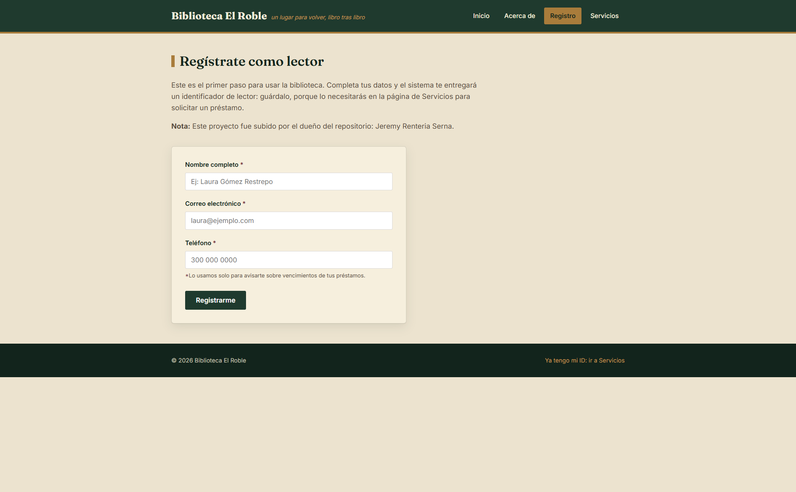

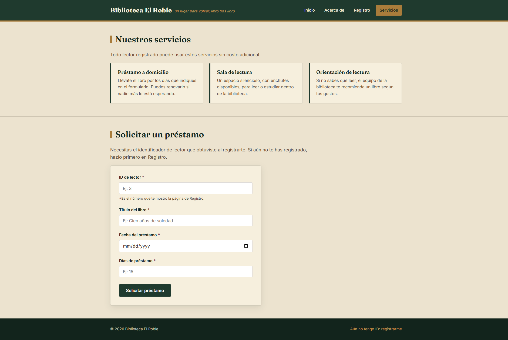

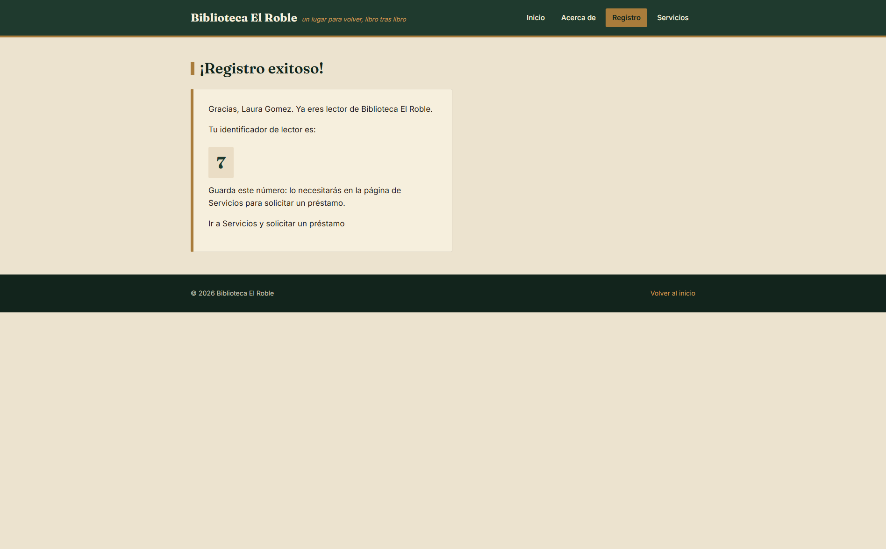

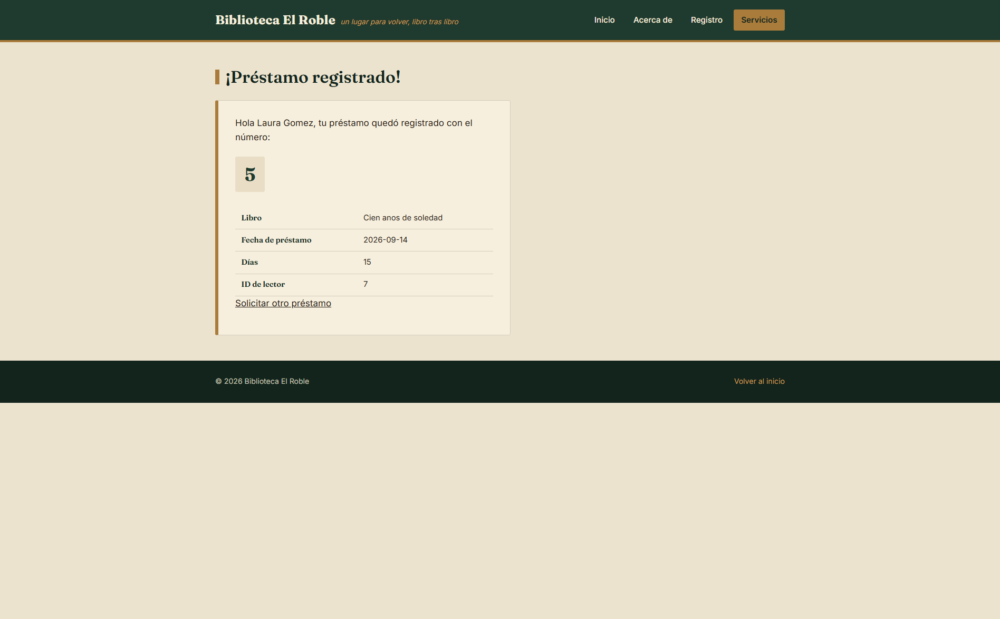

### SQLite y terminal

- `tabla1.png`: tabla `lectores` abierta en SQLite.
- `tabla2.png`: tabla `prestamos` abierta en SQLite.
- `tabla3.png`: tabla interna `sqlite_sequence`.
- `terminal.png`: mensajes del servidor y confirmaciones.
- `paginanoencontrada.png`: respuesta para una ruta inexistente.

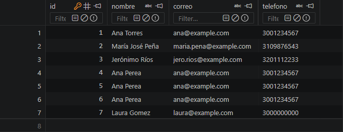

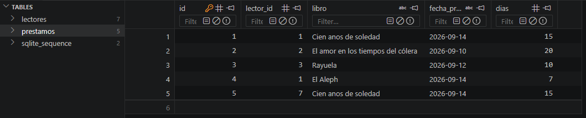

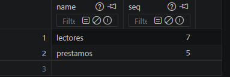

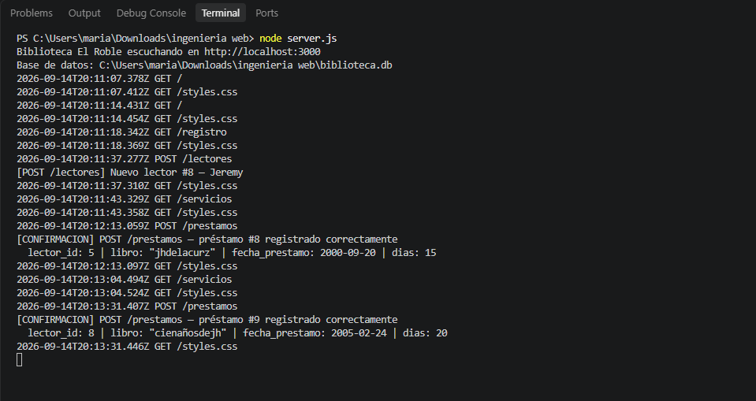

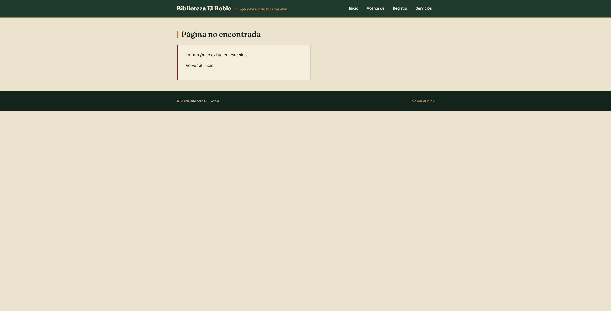
