# Biblioteca El Roble

**Autor:** Jeremy Renteria Serna  
**Asignatura:** Ingeniería Web  
**Temática:** Biblioteca

Aplicación web de una biblioteca desarrollada con Node.js y SQLite. Permite registrar lectores y solicitar préstamos usando el ID generado por el registro.

## Tecnologías

- HTML semántico y CSS externo.
- Node.js con `node:http`, `node:fs`, `node:path` y `node:sqlite`.
- SQLite mediante `DatabaseSync`.
- Sin frameworks ni dependencias externas.

## Estructura

```text
ingenieria web/
├── index.html
├── acerca.html
├── registro.html
├── servicios.html
├── styles.css
├── server.js
├── biblioteca.db
├── capturas/
└── README.md
```

## Base de datos

El archivo `biblioteca.db` contiene dos tablas:

### `lectores`

| Columna | Tipo | Descripción |
|---|---|---|
| `id` | INTEGER | ID autoincremental |
| `nombre` | TEXT | Nombre del lector |
| `correo` | TEXT | Correo del lector |
| `telefono` | TEXT | Teléfono del lector |

### `prestamos`

| Columna | Tipo | Descripción |
|---|---|---|
| `id` | INTEGER | ID autoincremental |
| `lector_id` | INTEGER | ID existente en `lectores` |
| `libro` | TEXT | Libro solicitado |
| `fecha_prestamo` | TEXT | Fecha del préstamo |
| `dias` | INTEGER | Duración del préstamo |

## Rutas

| Método | Ruta | Función |
|---|---|---|
| GET | `/` | Página principal |
| GET | `/acerca` | Información del proyecto |
| GET | `/registro` | Formulario de lectores |
| GET | `/servicios` | Formulario de préstamos |
| POST | `/lectores` | Registra nombre, correo y teléfono |
| POST | `/prestamos` | Registra lector_id, libro, fecha_prestamo y dias |

## Requisitos

- Node.js 24 o superior. Este proyecto usa `node:sqlite`, incluido en Node.js.
- No es necesario ejecutar `npm install`.

## Ejecutar localmente

Desde PowerShell:

```powershell
git clone https://github.com/JeremyRenteria/Biblioteca.git
cd Biblioteca
node --version
node server.js
```

También se puede ejecutar directamente desde la carpeta local:

```powershell
cd "C:\Users\maria\Downloads\ingenieria web"
node server.js
```

Luego abre:

```text
http://localhost:3000
```

El servidor imprime la URL, la ruta de `biblioteca.db`, las peticiones recibidas y las confirmaciones de los formularios. Para detenerlo, presiona `Ctrl + C`.

## Prueba manual

1. Abre `http://localhost:3000/registro`.
2. Completa nombre, correo y teléfono.
3. Guarda el ID generado por SQLite.
4. Abre `http://localhost:3000/servicios`.
5. Escribe el ID, libro, fecha y días.
6. Envía el préstamo y revisa la confirmación en la página y en la terminal.

Ejemplo de confirmación en terminal:

```text
[CONFIRMACION] POST /prestamos — préstamo registrado correctamente
  lector_id: 7 | libro: "Rayuela" | fecha_prestamo: 2026-09-14 | dias: 10
```

## Capturas

Las evidencias están en `capturas/` y también se muestran en esta documentación:

### Páginas y respuestas

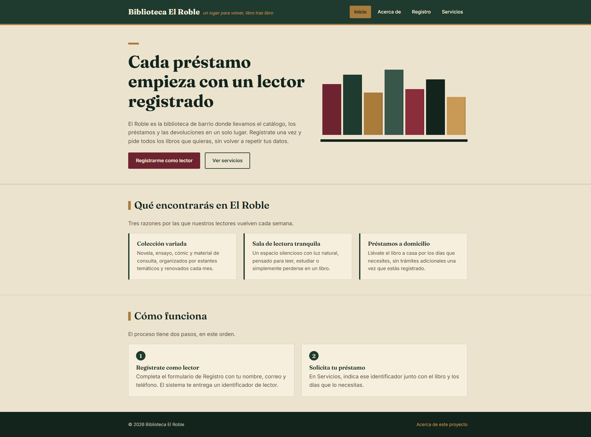

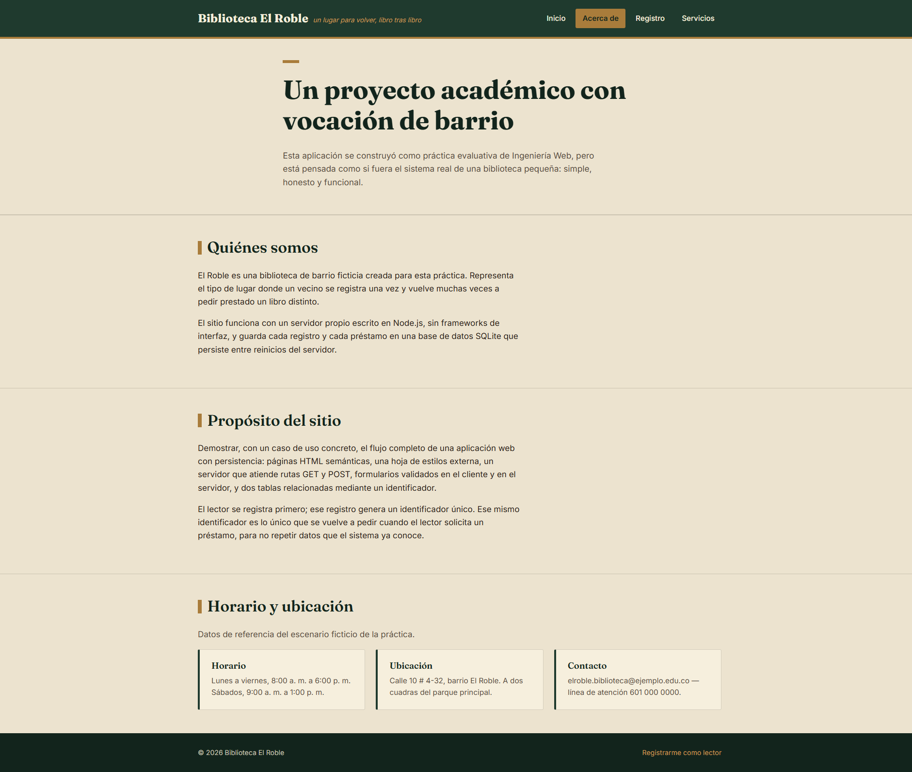

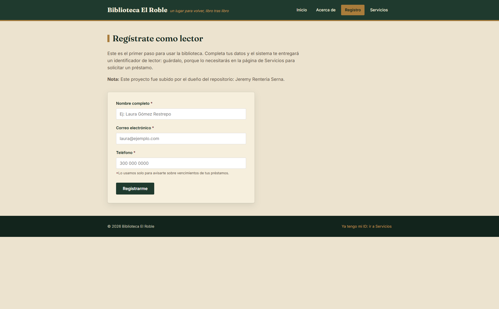

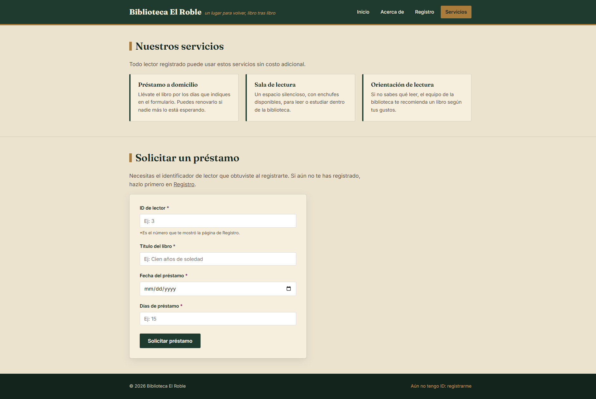

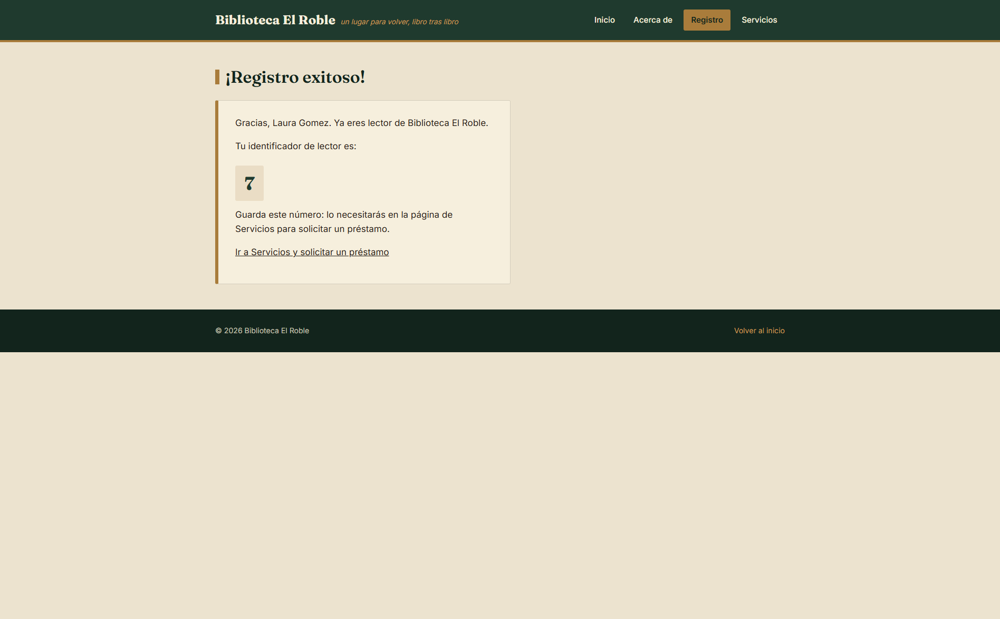

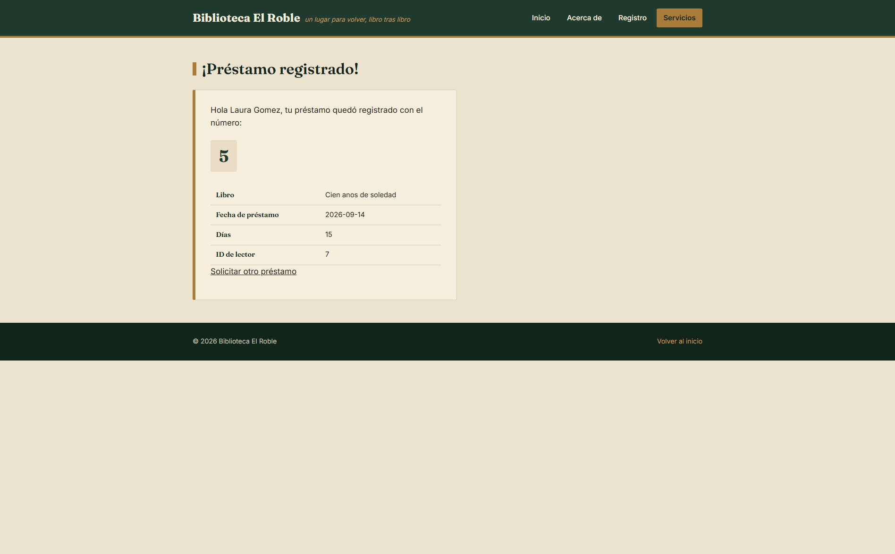

### SQLite y terminal

- `tabla1.png`: tabla `lectores` abierta en SQLite.
- `tabla2.png`: tabla `prestamos` abierta en SQLite.
- `tabla3.png`: tabla interna `sqlite_sequence`.
- `terminal.png`: mensajes del servidor y confirmaciones.
- `paginanoencontrada.png`: respuesta para una ruta inexistente.

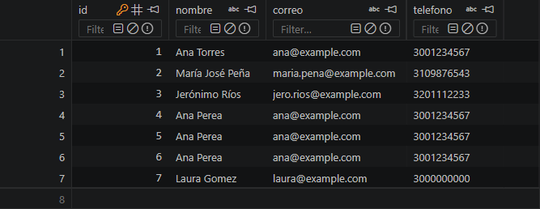

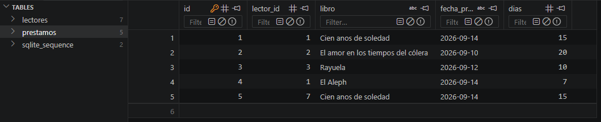

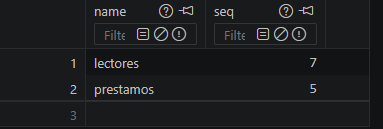

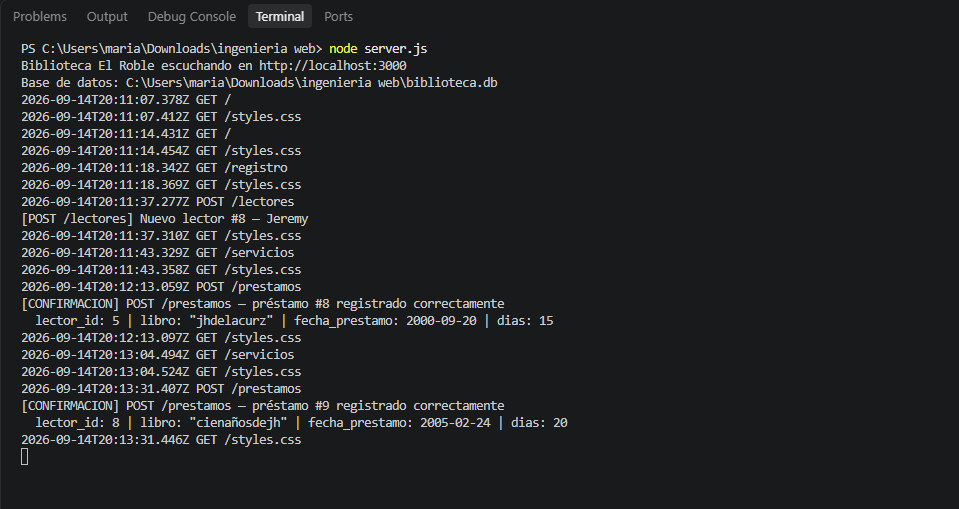

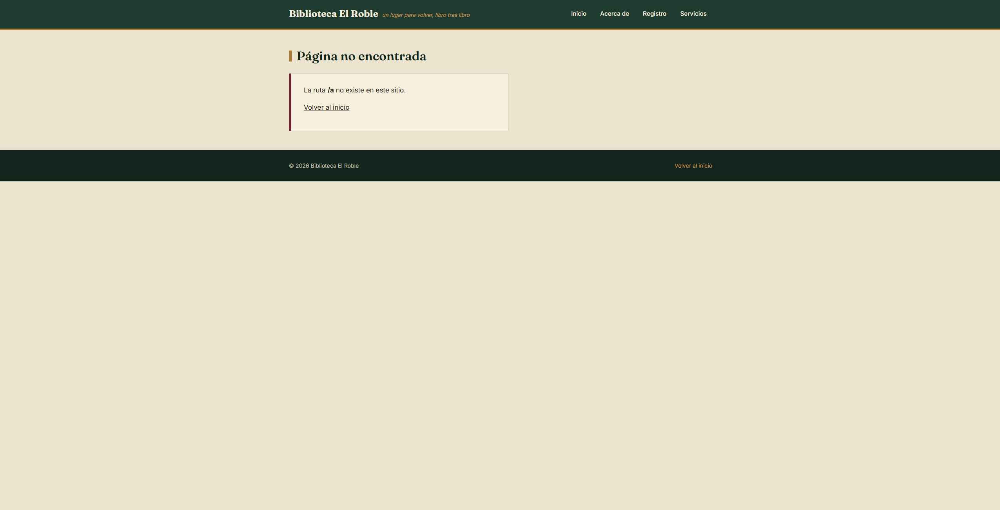

## Documentación OOHDM

La plataforma fue diseñada y documentada aplicando la metodología **OOHDM** (*Object-Oriented Hypermedia Design Method*). Toda la documentación está en [`docs/oohdm/`](docs/oohdm/OOHDM.md):

- [`OOHDM.md`](docs/oohdm/OOHDM.md): explicación de los cuatro modelos, matriz de correspondencia diseño-código y hallazgos de consistencia.
- [`01_modelo_conceptual.png`](docs/oohdm/01_modelo_conceptual.png): clases `Lector` y `Préstamo` con multiplicidad 1 — 0..*.
- [`02_modelo_navegacional.png`](docs/oohdm/02_modelo_navegacional.png): nodos, menú, enlaces y uso del ID de lector.
- [`03_interfaz_abstracta.png`](docs/oohdm/03_interfaz_abstracta.png): formularios de Registro y Servicios y sus respuestas.
- [`04_implementacion.png`](docs/oohdm/04_implementacion.png): navegador, Node.js, rutas HTTP y SQLite.
- [`fuentes_editables/`](docs/oohdm/fuentes_editables/): archivos `.dot` (Graphviz) de los cuatro diagramas.

### Relación con la plataforma

| Modelo OOHDM | Dónde se materializa |
|---|---|
| Conceptual | Tablas `lectores` y `prestamos` de `biblioteca.db` (`lector_id` enlaza ambas). |
| Navegacional | Rutas `GET /`, `/acerca`, `/registro`, `/servicios` y respuestas de `POST /lectores` y `POST /prestamos`. |
| Interfaz abstracta | Formularios de `registro.html` (`/lectores`) y `servicios.html` (`/prestamos`) y sus respuestas 201 y 400. |
| Implementación | `server.js` (Node.js + `node:sqlite`), archivos HTML y `styles.css`. |

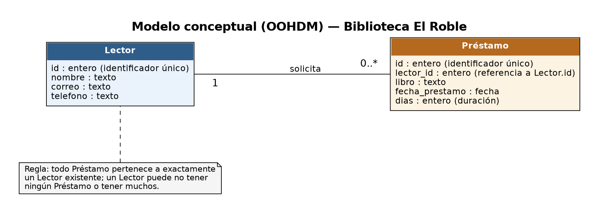

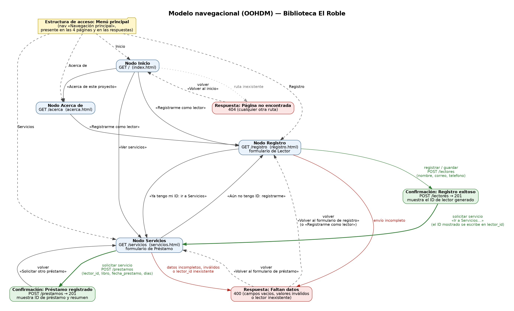

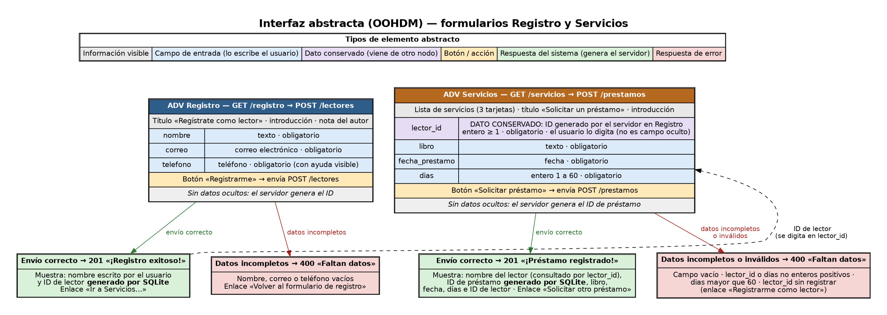

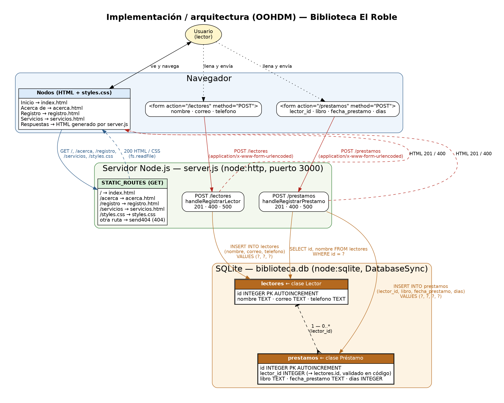

### Ajuste derivado del análisis OOHDM

Al contrastar los diagramas con el código se detectó que el formulario de `/servicios` limita `dias` a 1–60 pero el servidor no lo validaba. Ahora `POST /prestamos` responde 400 si `dias` supera 60. El resto del funcionamiento y la base de datos no cambian (detalle en la sección 6 de [`OOHDM.md`](docs/oohdm/OOHDM.md)).

### Descargar, ejecutar y comprobar

1. Descarga o clona el repositorio (`git clone https://github.com/JeremyRenteria/Biblioteca.git`) y entra a la carpeta.
2. Ejecuta `node server.js` (requiere Node.js 24 o superior; no hay que instalar dependencias).
3. Abre `http://localhost:3000/registro`, registra un lector y anota el ID.
4. Abre `http://localhost:3000/servicios` y solicita un préstamo con ese ID; ambos registros quedan en `biblioteca.db`.
5. Comprueba el rechazo: envía un préstamo con un ID inexistente o con `dias` mayor que 60 y verás la respuesta 400 «Faltan datos».
